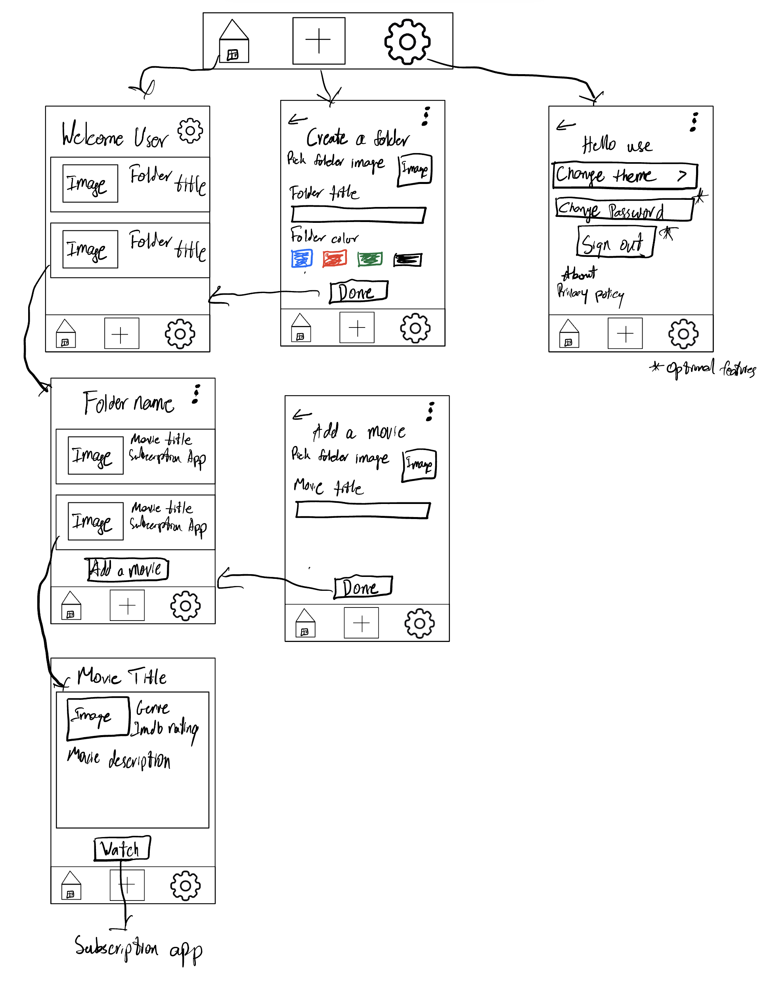
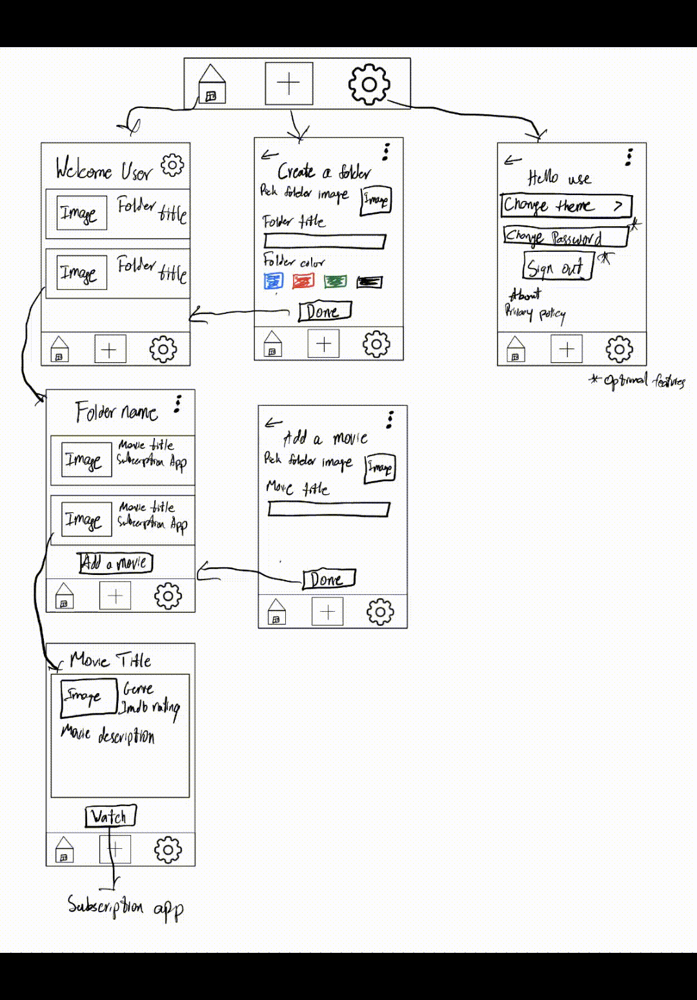

# CineMerge

## Table of Contents

1. [Overview](#Overview)
2. [Product Spec](#Product-Spec)
3. [Wireframes](#Wireframes)
4. [Schema](#Schema)

## Overview

### Description

An app where a user can create a folder based on movie genre, favorite actor/actress and can add movies from different streaming services into one folder. Users can also collabrate with friends or the public to put a list for a movie night or movie suggestions in general

### App Evaluation

- **Category:** Entertainment
- **Mobile**: An app makes it easier to share a movie straight from streaming apps without needing to copy link and putting back to the website
- **Story**: Allows for users to create a watch list from multiple movie subsctiptions and share with friends to collabreate and grow the list
- **Market**: Anyone who watchs movies and needs suggestions can share what they want on the folder and even put in reddit threads, group chats to get suggestions from the public
- **Habit**:  User or invited users add movies they are interested in watching then can later check off the movie they watched
- **Scope**: First start off with a offline version where only users can add movies and is saved to their device but later add a database and accounts so that collabration is possible for second version of the app

## Product Spec

### 1. User Stories (Required and Optional)

**Required Must-have Stories**

* User must be able to create Folders
* User must be able to add movie links, title and description
* User must be able to click on movies then watch the movie directly on the streaming app

**Optional Nice-to-have Stories**

* User can create account
* User can generate a unqiue link for each folder to share
* User can give edit access to public so public can add movies
* User can change folder icon/color

### 2. Screen Archetypes

- [X] Home Screen
* User can see all the folders they have created
* User can click on a folder to see the movies in the folder
* User can add a new folder
* User can delete a folder

- [X] Folder Screen
* User can see all the movies in the folder
* User can add a new movie to the folder
* User can delete a movie
* User can click on a movie to see the movie screen

- [X] Movie Screen
* User can see the movie thumbnail
* User can see the movie title
* User can see the movie description
* User can click on the movie to watch the movie
* User can delete the movie from the folder

### 3. Navigation

**Tab Navigation** (Tab to Screen)

* Home  
* Settings 
* Add Folder 

**Flow Navigation** (Screen to Screen)

- [X] Home Screen
* => Folder Screen
* => Add Folder Screen

- [X] Folder Screen
* => Movie Screen
* => Add Movie Screen

- [X] Movie Screen
* => Watch Movie Screen

- [X] Add Folder Screen
* => Home Screen

- [X] Add Movie Screen
* => Folder Screen

- [X] Settings Screen
* => Home Screen

## Wireframes

#### Picture View

### Sprints

- **Sprint 1** - Setup the project and create the basic UI(tab bar and navigation controllers, app icon)
- **Sprint 2** - Start connecting each pages with each other to pass data between them
- **Sprint 3** - Create a backend service to fetch movie data(Movie Title, Movie Icon and Movie Description) and save it to the local storage
- **Sprint 4** - Connect each movie to a streaming service to watch the movie

### Reflection
I am getting humbled by Xcode right now every little thing I have learned is getting tested and I ahve been going through the units to remember what I forgot when something breaks hopefully I can get this app to work by the end of the sprints

### Sprint 1 App Demo

    

### [BONUS] Digital Wireframes & Mockups

### [BONUS] Interactive Prototype

#### Figma Design
<iframe style="border: 1px solid rgba(0, 0, 0, 0.1);" width="800" height="450" src="https://www.figma.com/embed?embed_host=share&url=https%3A%2F%2Fwww.figma.com%2Ffile%2FjmdVcogrCFzzN7xKC7mO1y%2FMovie-Mobile-App-UI-Design-(Community)%3Ftype%3Ddesign%26node-id%3D0%253A1%26mode%3Ddesign%26t%3DjLQngppAycsAlZcE-1" allowfullscreen></iframe>

<a href="https://www.figma.com/file/jmdVcogrCFzzN7xKC7mO1y/Movie-Mobile-App-UI-Design-(Community)?type=design&node-id=0%3A1&mode=design&t=jLQngppAycsAlZcE-1">Figma Link</a>

## Schema 

[This section will be completed in Unit 9]

### Models

[Add table of models]

### Networking

- [Add list of network requests by screen ]
- [Create basic snippets for each Parse network request]
- [OPTIONAL: List endpoints if using existing API such as Yelp]
